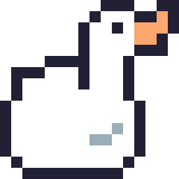
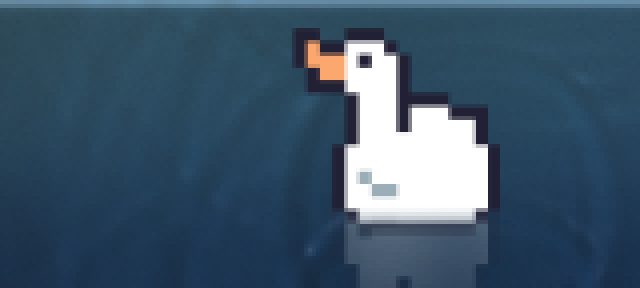
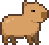
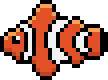
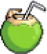
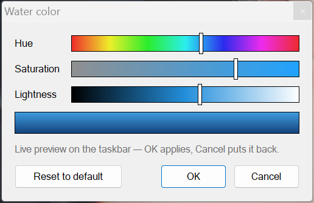

<div align="center">



# Floaty

**Your taskbar is a pool now.**

Floaty transforms the Windows taskbar into a living stretch of water — real-time
waves, ripples that follow your cursor, and a little companion drifting along
while you work. Fully click-through, invisible to your workflow, and light
enough that you'll forget it's running.

[](#installation)
[](#building-from-source)
[](LICENSE)
[](#performance)


*Live capture — cursor ripples, wandering duck, all on a real taskbar.*



</div>

---

## Why Floaty

Most desktop toys fight you for attention. Floaty does the opposite: it turns
dead pixels at the bottom of your screen into something quietly alive, without
taking a single click, keystroke, or frame of your attention away from real
work.

- **Never in your way.** The overlay is 100% click-through — every button,
  icon, and tooltip on your taskbar works exactly as before.
- **Real water, not a GIF.** A height-field wave simulation runs at a fixed
  60 Hz: wakes trail behind the swimmer, your cursor stirs the surface, and
  crests catch specular light with foam where waves break. Stir close to the
  character and the ripples rock it — heave and pitch ride real springs, so
  a sharp wave sets the hull visibly bobbing before it settles.
- **A companion, not a loop.** Characters wander, pause, turn around with a
  little squash-and-stretch, bob on the swell, and occasionally splash —
  driven by simulation, so no two minutes look the same.
- **Native and tiny.** Pure Win32 + Direct3D 11 + DirectComposition. One
  ~1 MB executable. No Electron, no runtime, no background updater.

## The cast

| | Character | Style |
|:---:|---|---|
|  | 🦆 **Duck** | Paddles on the surface, reflection below, occasionally dips its head |
|  | 🐹 **Capybara** | Soaks half-submerged, onsen-style, only its head above the surface |
|  | 🐠 **Clownfish** | Swims mid-water with a generated tail-sweep animation |
|  | 🥥 **Coconut** | Drifts, bobs, and sways like the real thing off a beach |
|  | ⛵ **Sailboat** | Cruises with a waving pennant and rippling sails |
| | 🎲 **Surprise me** | Rotates through the cast at random on a timer |
| | 🖼️ **Custom** | [Import any image](#custom-characters) from the tray, or bring your own sprite sheet |

Everything above is switchable in two clicks from the tray icon.

## Installation

Grab either flavor from [Releases](https://github.com/NooberCong/floaty/releases):

- **`FloatySetup.exe`** — a tiny installer: Start-menu shortcut, clean
  uninstaller, no admin rights needed.
- **`floaty.exe`** — fully portable: run it, and look at your taskbar.
  That's the entire install.

Enable **Start with Windows** from the tray menu to make it permanent. To
uninstall: use the uninstaller — or for the portable exe, tray → Exit and
delete the file. Floaty writes nothing outside `%APPDATA%\floaty` and a single
autostart registry value (only if you opt in).

## Settings

Right-click the tray duck for the essentials — pause, character picker, water
color, mouse ripples, autostart. Everything else lives in
`%APPDATA%\floaty\config.toml`, which hot-reloads the moment you save:

| Key | Default | What it does |
|---|---|---|
| `character` | `"duck"` | `duck`, `capybara`, `fish`, `coconut`, `boat`, `custom`, or `rotate` |
| `rotate_minutes` | `5.0` | Minutes per character in rotate mode |
| `scale` | `0.8` | Character size relative to taskbar height |
| `speed` | `1.0` | Movement speed multiplier |
| `water_opacity` | `0.42` | Water body opacity (0–1) |
| `water_shallow` / `water_deep` | blues | Surface / depth colors (`#rrggbb`) |
| `wave_intensity` | `1.0` | Ambient wave and ripple strength (0–2) |
| `mouse_ripples` | `true` | Stir the water with your cursor |
| `active_fps` / `idle_fps` | `60` / `30` | Frame rates in motion / at rest |
| `all_monitors` | `true` | Overlay secondary taskbars too |
| `autostart` | `false` | Launch at sign-in |

### Water color

Tray → **Water color…** opens hue, saturation, and lightness sliders that
repaint the pool live while you drag — the taskbar previews every shade in
real time, but nothing is saved until you decide. **OK** applies, **Cancel**
puts the old water back, **Reset to default** returns the stock blue. The
sliders shift the surface and depth colors together, so the water keeps its
sense of depth at any color — from vivid tropical blue to pastel pink to
milky white. (Prefer exact values? Set `water_shallow` / `water_deep` in the
config.)



### Custom characters

The easy way: tray icon → **Character** → **Import image…** — takes any
image Windows can decode (PNG, JPEG, GIF, BMP, WebP, …), scales it down to
taskbar size, and sets it afloat. Imports get the full float physics:
bobbing on the swell, swaying like the coconut, rocking when ripples pass
underneath, reflection included. Transparent backgrounds are trimmed
automatically, and the import is copied into `%APPDATA%\floaty`, so it keeps
working if the original file moves.

Power users can hand-wire an animated sprite sheet instead — any
horizontal-strip PNG:

```toml
character = "custom"

[custom_sprite]
path = 'C:\art\my-otter.png'
frame_width = 64
frame_height = 64
fps = 6.0
mode = "floater"   # rides the surface — or "swimmer" to glide submerged
facing = "right"   # direction the art faces in the sheet
```

## Performance

Floaty is engineered to be invisible in Task Manager, not just on screen:

- **~45 MB RAM, under 5% of one core** while actively animating at 60 fps
  (measured on a 2560×72 taskbar at 150% DPI)
- **Adaptive pacing** — drops to `idle_fps` when the water settles, skips
  rendering entirely while the taskbar is hidden or a fullscreen app /
  presentation is up
- **Zero-copy compositing** — `WS_EX_NOREDIRECTIONBITMAP` with a
  premultiplied-alpha DirectComposition swapchain, the same path DWM itself
  uses; no GDI, no redirection surface
- **Fixed-step simulation** — the wave equation always steps at 60 Hz, so
  ripple physics stay identical whether you render at 30 or 240 fps

## How it works

```
main.rs       event loop, frame pacing, overlay reconciliation, tray commands
taskbar.rs    tracks Shell_TrayWnd / secondary taskbars through moves & DPI changes
overlay.rs    click-through layered windows glued over each taskbar
gfx.rs        shared D3D11 device, per-overlay DComp swapchain, draw passes
shaders.hlsl  water shading: heightfield normals, specular, foam, waterline glow
sim.rs        two-buffer height-field wave equation on a downsampled CPU grid
character.rs  wander AI, two-point hull buoyancy on spring-dampers, turn squash
assets.rs     embedded sprites → trimmed, premultiplied GPU atlases
colorpicker.rs  water-color popup: H/S/L sliders with live taskbar preview
import.rs     "Import image…": file dialog → WIC decode → normalized sprite
config.rs     TOML config with hot reload · autostart.rs · tray.rs
```

Details worth knowing:

- The overlay never takes focus or input: `WS_EX_TRANSPARENT` +
  `WS_EX_NOACTIVATE`, with `WM_NCHITTEST` answering `HTTRANSPARENT`.
- Each character defines its own waterline; the pixel shader hides body
  pixels below it and clips the reflection above it, which is how the
  capybara soaks with only its head showing.
- Floaty survives `explorer.exe` restarts, taskbar relocation and resize,
  monitor hot-plug, and DPI changes — the overlay set reconciles once per
  second against the live taskbar list.
- If the GPU is unavailable it falls back to WARP software rendering rather
  than failing to start.

## Building from source

```
cargo build --release      # → target/release/floaty.exe
```

Stable Rust on Windows. MSVC toolchain works out of the box; the GNU
toolchain additionally needs `windres` on PATH (ships with MSYS2/MinGW).

## Credits

- **Duck** — [Pixel Duck Anim SpriteSheet](https://smolware.itch.io/pixel-geese-anim-spritesheet) by smolware
- **Capybara** — itch.io-hosted pixel art (artist unidentified — if it's yours, open an issue and we'll credit you)
- **Clownfish / Coconut / Sailboat** — supplied stills, animation frames generated by Floaty's tooling

## License

[MIT](LICENSE) © NooberCong. Sprite art remains under its creators' terms as
listed above.
